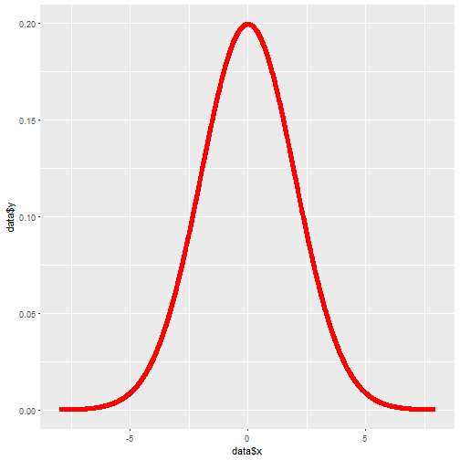

shiny_presentation
========================================================
author: Jose Montero
date: May 1st
autosize: true

Executive summary
========================================================

This presentation will show the details of the Shiny application created for the week 4 project of the course Data Product Development in Coursera.

The shiny application created will generate interactively a Normal Distribution where some parameters can be set and see the changes in the distribution.

The link to the shiny application is: https://monterojl.shinyapps.io/my_shiny_app/

R code is available in github: https://github.com/monterojl/shiny_app

ui.R file
========================================================
The ui file will show the following input controls:
- a numeric input to gather the desired standard deviaton
- an slider to set the x values
- a radio button control to select the color of the figure

You can play with the Standard Deviation and the x values to see how the Normal distribution look like. Mean will be always set to 0.

Here you have *an extract* from the R code of the input controls used:


```r
numericInput("stdDev", "Pick Standard Deviation", value = 3, min = 0.5, max = 5, step = 0.5),
sliderInput("sliderX", "Pick Minimum and Maximum X Values", -10, 10, value = c(-5, 5)),
radioButtons(inputId="colors", label="What color would you like to see?", 
                      choices=c("red","green","black")),
```


server.R file
========================================================
The server file will get the values set in the interface and create a Normal Distribution plot.

It will use ggplot, setting the values specified, the color set for the line.

Here you have *an extract* of the R code used for the server, where the distribution is created:

```r
# generate x value ranges
xvals <- seq(minX, maxX, by = .01)
# generate data from normal distribution for stdDev
data <- data.frame(
   y = dnorm(xvals, mean = 0, sd = stdDev), xvals
)
# plot
ggplot(data, aes(x = data$x, y = data$y)) + geom_line(size = 2, color = color)
```

Output example
========================================================
Find below an example of the output generated for a Standard Deviation of 2, and a x range of (-8,8).

